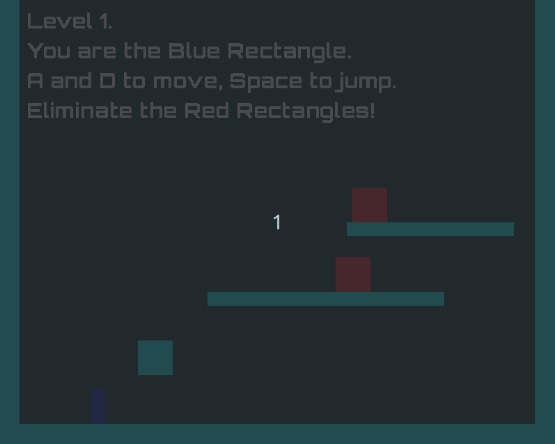

# Blue Rectangle

A 2D demo platformer game made using [dunai](https://github.com/ivanperez-keera/dunai), [Bearriver](https://hackage.haskell.org/package/bearriver) and [Haskell SDL2 bindings](https://hackage.haskell.org/package/sdl2). This game implements a variant of continuous collision detection.

Rules:
- You are the Blue Rectangle.
- Red Rectangles are the enemies.
- To complete a level eliminate all of the Red Rectangles by jumping on top of them.
- Level is restarted if you collide with an enemy not by jumping on top of it.


Controls:
- A to move left
- D to move right
- Space to jump



The game implements continuous collision detection following an idea suggested in the paper [Functional Reactive Programming, Refactored (Perez et al.)](https://www.cs.nott.ac.uk/~psxip1/papers/2016-HaskellSymposium-Perez-Barenz-Nilsson-FRPRefactored-short.pdf). Section 7.1.3 outlines how predicted collision times can be calculated from within the MSFs and how the times can be retrieved from the top level reactimate functions. This is done by using `CCDGameMonad` which is defined in the paper and which allows holding predicted collision times in writer monad context. Example given in the paper is a simple case of a bouncing ball in one dimension. In this game the idea is implemented in 2D setting with multiple moving objects.

For reference, bellow is the definition of `CCDGameMonad` used in this project, `tellFututureTime` is an MSF that puts a `FutureTime` value in the writer context (the context holds the minimal told value).

```haskell
type DTime = Double

data FutureTime = AtTime DTime | Infinity
  deriving (Eq, Ord, Show)

instance Semigroup FutureTime where
  (<>) = min

instance Monoid FutureTime where
  mempty :: FutureTime
  mempty = Infinity

type CCDGameMonad m = ReaderT DTime (WriterT FutureTime m)

type GameMonad = (CCDGameMonad Identity)

tellFutureTime :: MSF GameMonad FutureTime ()
tellFutureTime = liftTransS $ arrM tell
```


## Rough outline of the game physics

Each game object (enemy, player, static environment block) holds its trajectory data (position, velocity, acceleration). Accelerations are constant between the collision events and control changes. So the trajectories can be thought to be piecewise parabolas. At every step:

- For each object its trajectory is update (according to the current parabola), and new control information is gathered.
- Taking all of the object trajectories, new collision information is calculated.
- Taking collision information and control information of all the objects, new trajectories are calculated and switching event is produced to update object trajectories.
- Based on new trajectories, nearest collision time is predicted (since trajectories are parabolas, it boils down to solving a bunch of quadratic equations).

At the top level game logic loop, the nearest collision time can be extracted from monadic context. If needed, multiple physics steps can be performed for every rendering sample, taking into account extracted predicted collision times and not demanding physics steps with times beyond nearest collision (to avoid bullet effect).

## Running the game (Linux)

1. Install GHC and cabal. One way to do this is using [GHCup](https://www.haskell.org/ghcup/install/).


2. Install SDL2 library dependencies:
    ```
    sudo apt-get install libsdl2-dev libsdl2-image-dev libsdl2-ttf-dev libsdl2-mixer-dev
    ```
3. Clone the repository.

4. Build and run the game using cabal inside the root folder of the repository:
    ```
    cabal run
    ```

## Relevant literature

I would like to point to some literature that I reviewed while working on this project and from which I took some ideas: 

- [Antony Courtney, Henrik Nilsson, John Peterson. The Yampa Arcade.](https://dl.acm.org/doi/10.1145/871895.871897) A good extended example on how to structure games with heterogeneous actors using Yampa library.
- [Ivan Perez, Manuel Bärenz,  Henrik Nilsson. Functional Reactive Programming, Refactored.](https://www.cs.nott.ac.uk/~psxip1/papers/2016-HaskellSymposium-Perez-Barenz-Nilsson-FRPRefactored-short.pdf) An introduction to monadic stream functions and Dunai library. 
- [Ivan Perez. Extensible and Robust Functional Reactive Programming.](http://www.cs.nott.ac.uk/~psxip1/papers/2017-Perez-thesis-latest.pdf) Parts of this PhD thesis covers topics on applications of monadic stream functions in game programming in greater detail, it could be used as a supplement to [FRP Refactored](https://www.cs.nott.ac.uk/~psxip1/papers/2016-HaskellSymposium-Perez-Barenz-Nilsson-FRPRefactored-short.pdf) paper.
